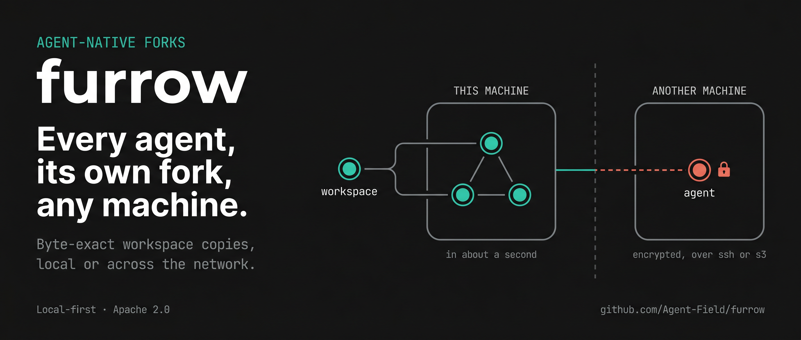

<div align="center">

# furrow

### Every agent, its own fork, any machine

[](LICENSE)
[](https://github.com/Agent-Field)

<p>
  <a href="#parallel-agents-one-machine">Parallel Agents</a> •
  <a href="#parallel-agents-another-machine">Distributed Agents</a> •
  <a href="#rewind-what-git-cant-see">Rewind</a> •
  <a href="#the-rest-of-the-daily-kit">Daily Kit</a> •
  <a href="#how-its-built">Architecture</a>
</p>



</div>

**furrow copy-on-write forks your entire workspace, every file, dependency, and piece of local state, into a byte-exact copy in about a second. Fork it right here on your machine for another terminal, or send it to a cloud sandbox or your other laptop with the same guarantee.**

One fork, one primitive, wherever an agent runs: instant and disk-cheap right next to you, or sealed and encrypted so it can reach a completely different machine. You stop being the one who copies config and reseeds state by hand before an agent can even start.

```bash
cd my-project && furrow watch
```

That's the whole setup. From this moment your workspace is continuously sealed into an immutable, content-addressed timeline: fork it, diff it, merge it, materialize it on another machine, rewind it when anything — human or agent — breaks it. Git versions your commits; furrow versions everything between them.

Local-first and Apache-2.0. No account, no telemetry, works offline. Remotes, when you add them, receive only ciphertext.

Every scenario below is a runnable script in [`./demo/`](demo/).

---

## Parallel agents, one machine

Start your agents the way you always start them — just more of them. One optional alias gives every session its own universe automatically:

```bash
alias claude='furrow exec -- claude'    # once, in your shell profile
```

Now open three terminals and run `claude` in each. Each session gets a warm, isolated copy of the *full* working state — dependencies, `.env`, database, everything — via filesystem copy-on-write: ready in about a second, and ten universes cost roughly the disk of one. No cold `npm install`, no port collisions, no shared files to fight over.

While they work, **conflict radar** watches all universes and flags two agents touching the same file *before* merge time. Agents can partition work and leave notes for each other through plain files — no orchestrator. When a universe is done:

```bash
furrow merge <universe> --check "cargo test --all"    # lands only if your checks pass
```

Skip the alias and sessions simply share the directory like today — still sealed continuously, still collision-warned. `furrow forks` shows every universe, its real disk cost, and live conflicts whenever you're curious.

## Parallel agents, another machine

Same fork, different machine. Cloud sandboxes and second machines normally see your last push — never your dirty edits, `.env`, dev database, or Git index. furrow materializes your *current state*, exactly, on any machine that can reach yours (SSH over LAN or Tailscale), or through any S3-compatible bucket as an always-available encrypted mailbox. No hosted service required.

```bash
furrow remote add ssh://dev@machine-a.tailnet --name my-project && furrow sync --follow

# on the other machine — the clone is your complete working state, not a checkout
FURROW_RECOVERY_KEY=<key> furrow clone ssh://dev@machine-a.tailnet/my-project
```

`sync --follow` keeps a warm session both ways: seal on one machine, and it's on the other before you've switched chairs. Transfers are deduplicated deltas — a day of work syncs as kilobytes. Remotes hold only ciphertext; the recovery key (entered once per machine) is the only thing that can read a workspace.

> A laptop died mid-session. The exact working directory — dirty edits, `.env`, dev database — came back on a different machine from an S3 bucket that never saw plaintext.

**Measured, end-to-end:** Agent A edits source and tests on one machine, furrow
encrypts and publishes the sealed state, and Agent B receives a usable workspace
on a separate machine, reviews it, and sends a follow-up change back.

| Two-agent workflow | End-to-end rate |
|---|---:|
| Optimized warm handoff gate between two running workspaces | **4.1 handoffs/s** |
| Actual furrow repo, cold publish over the internet | **0.27 MB/s** |
| Actual furrow repo, cold materialization on machine B | **0.40 MB/s** |
| Raw `scp` of the same uncompressed repo payload | **0.71 MB/s** |

The real-repo run covered 67 files / 1.14 MB plus two source-and-test agent
turns. Rates include encryption and transport; handoff and materialization also
include making the destination usable. Idle RSS was 16.6 MB on machine A and
15.7 MB on machine B for its follower plus A's remote helper. The encrypted
remote occupied 12.9 MB after the cold state and retained agent turns. These are
observed integration results, not guarantees.

## Rewind what Git can't see

An agent just ran `git clean -fdx`, trashed `.env`, and corrupted the dev database. Git protects none of that; furrow's timeline holds all of it — and every rewind seals the current state first, so rewinding is itself rewindable.

```bash
furrow timeline                          # scrub your history — turns, labels, quiet points
furrow rewind <snapshot> --paths .env    # one secret back, newer work untouched
furrow rewind <snapshot>                 # or the whole workspace, byte-exact
```

Restoration covers symlinks, permissions, extended attributes, SQLite (with a logically consistent image available), and Git's own mutable state. `--dry-run` previews any rewind's impact first.

> `.env` and the dev SQLite database, both back, both intact, after an agent ran `git clean -fdx`.

## The rest of the daily kit

- **`furrow try -- npm install framework@latest`** — run anything risky with automatic before/after restore points. Keep the result or be back in seconds.
- **`furrow bisect -- cargo test`** — "it worked twenty minutes ago" usually has no commit to bisect. This bisects *states*, in disposable CoW forks, and finds the breaking moment even when the culprit was an `.env` edit or a dependency change Git never saw.
- **`furrow shrink`** — reclaims recognized dependency/build caches with honest numbers; everything removed stays exactly restorable.
- **`furrow ui`** — Mission Control: timeline scrubbing, universes, live radar, diffs, and merge preview in a local page embedded in the binary. No Node, no CDN, no account.

## Built for agents as first-class users

The CLI is the agent API: `--json` everywhere, stable IDs from every mutation, structured errors, and destructive operations gated on explicit IDs plus `--yes` — a prompt in machine mode is an error, not a hang. `furrow hook install` turns agent turns into attributed restore points; `furrow events --follow` streams seals, conflicts, and merges as resumable NDJSON; `furrow mcp` serves harnesses that prefer MCP. Nothing in furrow knows which agent is calling — Claude Code, Codex, Cursor, or a shell script get the same contract.

<details>
<summary><strong>Full command reference</strong> — every command, one line each</summary>

| Command | What it does |
|---|---|
| `furrow watch` | Attach a repo and start continuous sealing |
| `furrow exec -- <cmd>` | Run a command inside its own isolated universe |
| `furrow merge <universe> --check "<cmd>"` | Land a universe's changes, only if checks pass |
| `furrow forks` | List universes, disk cost, live conflicts |
| `furrow timeline` | Scrub sealed history |
| `furrow rewind <snapshot> [--paths] [--dry-run]` | Restore workspace state, whole or partial |
| `furrow try -- <cmd>` | Run something risky with automatic before/after restore points |
| `furrow bisect -- <cmd>` | Bisect workspace state, not just commits |
| `furrow shrink` | Reclaim recognized dependency/build caches |
| `furrow ui` | Mission Control — local web UI, no account |
| `furrow remote add <url>` | Add a remote (SSH or S3-compatible) |
| `furrow sync --follow` | Keep a warm two-way sync session with a remote |
| `furrow clone <url>` | Materialize a workspace's exact state on another machine |
| `furrow hook install` | Turn agent turns into attributed restore points |
| `furrow events --follow` | Stream seals/conflicts/merges as NDJSON |
| `furrow mcp` | Serve furrow over MCP for harnesses that prefer it |

</details>

## How it's built

The load-bearing decisions, for readers who want them ([full specs](docs/README.md)):

- **Immutable Merkle DAG over content-defined chunks.** A snapshot ID exists only after every referenced byte is durable. Sealing cost scales with changed entries, never repository size; memory stays bounded regardless of file size.
- **Crash-safe by construction.** Hash-verified append-only packs, an fsynced hash-chained publication log, recovery from truncated pack tails and deleted indexes — SQLite is an advisory index, never the truth.
- **Warm forks via native CoW** — APFS `clonefile`, Linux `FICLONE` — with a streaming-copy fallback whose cost is disclosed before the fork runs.
- **Retention with honest grades.** Timelines thin under hard disk budgets; every snapshot knows whether it's byte-exact or partial, and every missing path knows its recovery route. Pins override everything. `furrow estimate` projects store cost before you ever attach.
- **Encryption below the transport.** XChaCha20-Poly1305, opaque remote names, every chunk verified against its BLAKE3 identity on restore; path traversal and symlink-escape tricks rejected at the boundary.
- **The store never lives inside the repository.** `.furrow/` holds a pointer and policy; deleting it is recoverable. Exclusions (`.furrowpolicy`: `exclude node_modules`) are honored by capture, watcher, and rewind alike.

Reproducible performance claims — `cargo bench --bench engine` (regression ceilings checked on macOS and Linux; a 1M-file reference profile available). Methodology and baselines: [docs/performance.md](docs/performance.md).

## Honest edges

- Cross-machine divergence is preserved and reported, not yet auto-merged — smoothest today: one writer at a time, hand off after convergence.
- Same-path universes are Linux; macOS uses disclosed sibling directories.
- Cold internet sync has been rerun; the final receiver optimization still needs a warm internet rerun.
- Fidelity is declared, not implied: `furrow status --fidelity` is the contract.

## Development

```bash
cargo fmt --check && cargo clippy --all-targets --all-features -- -D warnings
cargo test --all
```

The black-box suite runs against independent temporary Git repositories and isolated stores: secret recovery, reversible rewind, metadata fidelity, SQLite logical recovery, index reconstruction, truncated-pack recovery, path-escape rejection, interrupted-rewind recovery, and fork isolation.

## License

Apache-2.0
